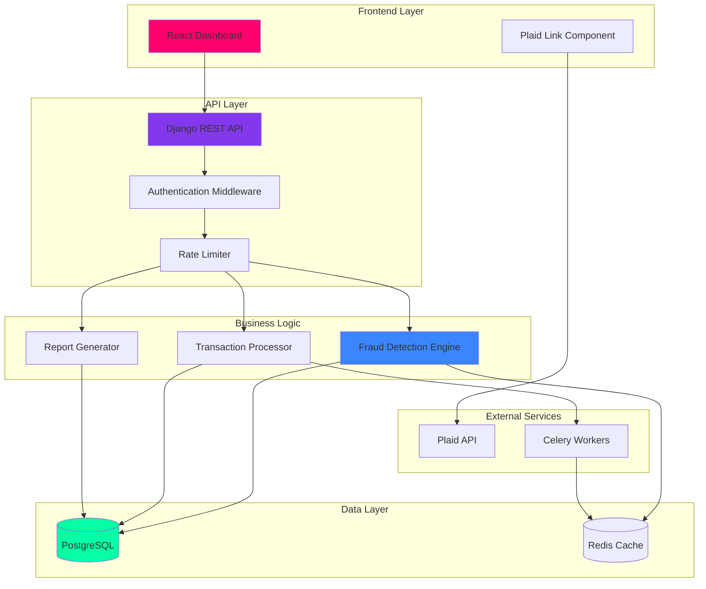

# SecurePath - Fraud Detection System


A comprehensive, full-stack fraud detection system featuring real-time transaction monitoring, machine learning-based risk scoring, and automated fraud detection with Plaid integration for secure financial data access.

## 📋 Table of Contents

- [Overview](#overview)
- [Features](#features)
- [Architecture](#architecture)
- [Prerequisites](#prerequisites)
- [Quick Start](#quick-start)
- [Detailed Setup](#detailed-setup)
- [API Documentation](#api-documentation)
- [Testing](#testing)
- [Deployment](#deployment)
- [Project Structure](#project-structure)
- [Contributing](#contributing)
- [License](#license)

## 🎯 Overview

SecurePath is an enterprise-grade fraud detection platform that combines the power of machine learning with real-time transaction monitoring to identify and prevent fraudulent activities. The system integrates with Plaid to securely access financial data and provides a modern, cyberpunk-themed dashboard for monitoring and analysis.

### Key Capabilities

- **Real-time Fraud Detection**: Analyze transactions as they occur using ML models
- **Plaid Integration**: Secure financial data access and bank account linking
- **Risk Scoring**: Automated risk assessment for each transaction
- **Bulk Processing**: Handle large CSV uploads for batch analysis
- **Comprehensive Reporting**: Export detailed reports in CSV and PDF formats
- **Audit Trail**: Complete logging of all system activities
- **RESTful API**: Well-documented API with versioning support
- **Modern UI**: Cyberpunk glassmorphism-themed responsive dashboard

## ✨ Features

### Backend (Django)

- 🔐 **Secure API** with Bearer token authentication
- 🤖 **Machine Learning** fraud detection using scikit-learn
- 📊 **Data Processing** with pandas and numpy
- 🔄 **Async Task Queue** using Celery and Redis
- 📈 **Performance Monitoring** with built-in metrics
- 🛡️ **Rate Limiting** to prevent API abuse
- 📝 **Comprehensive Logging** and audit trails
- 💳 **Plaid Integration** for financial data access
- 🧪 **Full Test Coverage** with pytest

### Frontend (React)

- ⚡ **Fast & Responsive** React 19 with modern hooks
- 🎨 **Cyberpunk Glassmorphism** design theme
- 📱 **Mobile-First** responsive design
- 📊 **Interactive Charts** using Chart.js
- 🔄 **Real-time Updates** with smooth animations
- 🏦 **Plaid Link** integration for bank connections
- 🎭 **Framer Motion** animations
- 🧭 **React Router** for seamless navigation

## 🏗️ Architecture



## 📦 Prerequisites

Before you begin, ensure you have the following installed:

- **Python 3.9+** - [Download](https://www.python.org/downloads/)
- **Node.js 18+** - [Download](https://nodejs.org/)
- **PostgreSQL 15+** - [Download](https://www.postgresql.org/download/) (or use SQLite for development)
- **Redis 7+** - [Download](https://redis.io/download) (optional, for Celery)
- **Git** - [Download](https://git-scm.com/downloads)

### Optional

- **Docker & Docker Compose** - [Download](https://www.docker.com/products/docker-desktop)
- **Plaid Account** - [Sign up](https://plaid.com/) for API keys

## 🚀 Quick Start

### Option 1: Automated Setup (Recommended)

```bash
# Clone the repository
git clone <your-repo-url>
cd securepath

# Run the setup script
chmod +x setup.sh
./setup.sh

# Start the backend (in one terminal)
cd backend
source venv/bin/activate  # On Windows: venv\Scripts\activate
python manage.py runserver

# Start the frontend (in another terminal)
cd frontend
npm start
```

The backend will be available at `http://localhost:8000` and the frontend at `http://localhost:3000`.

### Option 2: Docker Setup

```bash
# Clone the repository
git clone <your-repo-url>
cd securepath

# Start all services
docker-compose up --build
```

This will start:
- PostgreSQL database on port 5432
- Redis on port 6379
- Django backend on port 8000
- React frontend on port 3000
- Celery worker for background tasks

## 🔧 Detailed Setup

### Backend Setup

1. **Navigate to backend directory**
   ```bash
   cd backend
   ```

2. **Create and activate virtual environment**
   ```bash
   python -m venv venv
   source venv/bin/activate  # On Windows: venv\Scripts\activate
   ```

3. **Install dependencies**
   ```bash
   pip install -r requirements.txt
   ```

4. **Configure environment variables**
   ```bash
   cp .env.example .env
   # Edit .env with your configuration
   ```

   Key environment variables:
   ```env
   SECRET_KEY=your-secret-key-here
   DEBUG=True
   ALLOWED_HOSTS=localhost,127.0.0.1
   
   # Database (use SQLite for development)
   DB_ENGINE=django.db.backends.sqlite3
   DB_NAME=db.sqlite3
   
   # For production, use PostgreSQL:
   # DB_ENGINE=django.db.backends.postgresql
   # DB_NAME=securepath_db
   # DB_USER=your_db_user
   # DB_PASSWORD=your_password
   # DB_HOST=localhost
   # DB_PORT=5432
   
   # API
   API_TOKEN=your-secure-token-here
   
   # Plaid (get from https://dashboard.plaid.com/)
   PLAID_CLIENT_ID=your_plaid_client_id
   PLAID_SECRET=your_plaid_secret
   PLAID_ENV=sandbox  # or development, production
   
   # Celery (optional)
   CELERY_BROKER_URL=redis://localhost:6379/0
   ```

5. **Run database migrations**
   ```bash
   python manage.py makemigrations
   python manage.py migrate
   ```

6. **Create superuser (optional)**
   ```bash
   python manage.py createsuperuser
   ```

7. **Start development server**
   ```bash
   python manage.py runserver
   ```

8. **Start Celery worker (optional, in a new terminal)**
   ```bash
   # Make sure Redis is running first
   redis-server
   
   # In another terminal, activate venv and run:
   celery -A backend worker -l info
   ```

### Frontend Setup

1. **Navigate to frontend directory**
   ```bash
   cd frontend
   ```

2. **Install dependencies**
   ```bash
   npm install
   ```

3. **Configure environment variables**
   ```bash
   cp .env.example .env.local
   # Edit .env.local with your configuration
   ```

   Key environment variables:
   ```env
   REACT_APP_API_BASE_URL=http://localhost:8000/api
   REACT_APP_API_TOKEN=your-secure-token-here
   REACT_APP_PLAID_ENV=sandbox
   ```

4. **Start development server**
   ```bash
   npm start
   ```

   The app will open in your browser at `http://localhost:3000`.

## 📚 API Documentation

### Base URL

```
http://localhost:8000/api/v1
```

### Authentication

All endpoints (except `/status`) require Bearer token authentication:

```bash
Authorization: Bearer your-token-here
```

### Endpoints

#### Health Check
```http
GET /api/v1/status
```
Returns API status and version information.

#### Dashboard Statistics
```http
GET /api/v1/dashboard/stats
```
Returns overview statistics including total transactions, fraud count, and risk distribution.

**Response:**
```json
{
  "total_transactions": 1250,
  "fraud_count": 45,
  "fraud_percentage": 3.6,
  "total_amount": 125000.50,
  "avg_risk_score": 0.23
}
```

#### Get Transactions
```http
GET /api/v1/dashboard/transactions?page=1&page_size=20&status=all
```

**Query Parameters:**
- `page` (int): Page number (default: 1)
- `page_size` (int): Items per page (default: 20, max: 100)
- `status` (string): Filter by status - `all`, `fraud`, `legitimate`

**Response:**
```json
{
  "count": 1250,
  "next": "http://localhost:8000/api/v1/dashboard/transactions?page=2",
  "previous": null,
  "results": [
    {
      "id": 1,
      "transaction_id": "TXN001",
      "amount": 150.00,
      "timestamp": "2024-12-02T10:30:00Z",
      "risk_score": 0.15,
      "is_fraud": false,
      "merchant": "Amazon",
      "category": "Shopping"
    }
  ]
}
```

#### Upload Transactions
```http
POST /api/v1/upload
Content-Type: multipart/form-data
```

Upload a CSV file with transaction data.

**CSV Format:**
```csv
transaction_id,amount,timestamp,merchant,category
TXN001,150.00,2024-12-02 10:30:00,Amazon,Shopping
```

#### Detect Fraud
```http
POST /api/v1/detect-fraud
```

Run fraud detection on all unprocessed transactions.

#### Get Audit Logs
```http
GET /api/v1/audit-log?page=1&page_size=50
```

#### Export Reports
```http
GET /api/v1/export/csv
GET /api/v1/export/pdf
```

Export transaction reports in CSV or PDF format.

#### Plaid Integration
```http
POST /api/v1/plaid/create-link-token
POST /api/v1/plaid/exchange-public-token
GET /api/v1/plaid/transactions
```

For detailed API documentation, visit `http://localhost:8000/api/docs` when the server is running.

## 🧪 Testing

### Backend Tests

```bash
cd backend
source venv/bin/activate

# Run all tests
pytest

# Run with coverage report
pytest --cov=api --cov-report=html

# Run specific test file
pytest api/tests/test_models.py

# Run specific test
pytest api/tests/test_models.py::TestTransaction::test_create_transaction
```

Coverage report will be available in `htmlcov/index.html`.

### Frontend Tests

```bash
cd frontend

# Run tests in watch mode
npm test

# Run tests with coverage
npm test -- --coverage --watchAll=false

# Run specific test file
npm test -- TransactionTable.test.js
```

## 🚢 Deployment

### Production Checklist

- [ ] Set `DEBUG=False` in backend `.env`
- [ ] Use PostgreSQL instead of SQLite
- [ ] Configure strong `SECRET_KEY`
- [ ] Set up HTTPS/SSL certificates
- [ ] Configure CORS for production domains
- [ ] Set up proper logging and monitoring
- [ ] Configure email backend for notifications
- [ ] Set up Sentry or similar error tracking
- [ ] Configure automated backups
- [ ] Set up CI/CD pipeline
- [ ] Review and update `ALLOWED_HOSTS`
- [ ] Use production Plaid environment

### Docker Production Deployment

```bash
# Build production images
docker-compose -f docker-compose.prod.yml build

# Start services in detached mode
docker-compose -f docker-compose.prod.yml up -d

# Run migrations
docker-compose exec backend python manage.py migrate

# Collect static files
docker-compose exec backend python manage.py collectstatic --noinput

# Create superuser
docker-compose exec backend python manage.py createsuperuser
```

### Environment-Specific Settings

The backend uses environment-based settings:
- `backend/settings_dev.py` - Development settings
- `backend/settings_prod.py` - Production settings

Set `DJANGO_ENV=production` to use production settings.

## 📁 Project Structure

```
securepath/
├── backend/                    # Django backend
│   ├── api/                   # Main API application
│   │   ├── models.py         # Database models
│   │   ├── views.py          # API views
│   │   ├── serializers.py    # DRF serializers
│   │   ├── fraud_detection.py # ML fraud detection
│   │   ├── router_v1.py      # API routes
│   │   └── tests/            # Test suite
│   ├── backend/              # Django project settings
│   │   ├── settings_dev.py   # Development settings
│   │   ├── settings_prod.py  # Production settings
│   │   └── urls.py           # URL configuration
│   ├── manage.py             # Django management script
│   ├── requirements.txt      # Python dependencies
│   ├── Dockerfile           # Backend Docker config
│   └── .env.example         # Environment template
│
├── frontend/                  # React frontend
│   ├── public/               # Static assets
│   ├── src/
│   │   ├── components/       # React components
│   │   │   ├── Dashboard/   # Dashboard views
│   │   │   ├── Sidebar.js   # Navigation sidebar
│   │   │   └── PlaidLink.js # Plaid integration
│   │   ├── App.js           # Main app component
│   │   ├── index.css        # Global styles
│   │   └── index.js         # Entry point
│   ├── package.json         # Node dependencies
│   ├── Dockerfile          # Frontend Docker config
│   └── .env.example        # Environment template
│
├── docker-compose.yml       # Docker orchestration
├── setup.sh                # Automated setup script
├── README.md               # This file
└── .gitignore             # Git ignore rules
```

## 🎨 UI Features

The frontend features a modern **Cyberpunk Glassmorphism** theme with:

- **Glassmorphic Cards**: Translucent panels with backdrop blur
- **Neon Accents**: Vibrant cyan, magenta, and purple highlights
- **Smooth Animations**: Framer Motion powered transitions
- **Interactive Charts**: Real-time data visualization
- **Responsive Design**: Mobile-first approach
- **Dark Theme**: Eye-friendly dark color scheme

## 🔐 Security Features

- **API Authentication**: Bearer token-based authentication
- **Rate Limiting**: Prevents API abuse (100 requests/hour per IP)
- **CSRF Protection**: Django CSRF middleware enabled
- **SQL Injection Protection**: Django ORM parameterized queries
- **XSS Protection**: React automatic escaping
- **Secure Headers**: HTTPS enforcement in production
- **Environment Variables**: Sensitive data in `.env` files
- **Password Hashing**: Django's PBKDF2 algorithm

## 🤝 Contributing

Contributions are welcome! Please follow these steps:

1. Fork the repository
2. Create a feature branch (`git checkout -b feature/amazing-feature`)
3. Commit your changes (`git commit -m 'Add amazing feature'`)
4. Push to the branch (`git push origin feature/amazing-feature`)
5. Open a Pull Request

### Code Quality

**Backend:**
```bash
# Format code
black .

# Sort imports
isort .

# Lint code
flake8 .
```

**Frontend:**
```bash
# Lint code
npm run lint
```

## 📝 License

This project is licensed under the MIT License - see the LICENSE file for details.

## 👥 Authors

- **Manish Neupane** - *Initial work and development*

## 🙏 Acknowledgments

- [Django](https://www.djangoproject.com/) - High-level Python web framework
- [React](https://reactjs.org/) - JavaScript library for building user interfaces
- [Plaid](https://plaid.com/) - Financial data platform
- [scikit-learn](https://scikit-learn.org/) - Machine learning library
- [Chart.js](https://www.chartjs.org/) - JavaScript charting library
- [Framer Motion](https://www.framer.com/motion/) - Animation library
- [TailwindCSS](https://tailwindcss.com/) - Utility-first CSS framework
- [Celery](https://docs.celeryproject.org/) - Distributed task queue
- [Redis](https://redis.io/) - In-memory data structure store

## 📞 Support

For questions or issues, please:
- Open an issue on GitHub
- Contact: [your-email@example.com]

## 🗺️ Roadmap

- [ ] Add real-time WebSocket notifications
- [ ] Implement user authentication and roles
- [ ] Add more ML models for fraud detection
- [ ] Create mobile app (React Native)
- [ ] Add multi-language support
- [ ] Implement advanced analytics dashboard
- [ ] Add email/SMS alerts for fraud detection
- [ ] Create admin panel for system configuration

---

**Built with ❤️ for fraud prevention and financial security**
